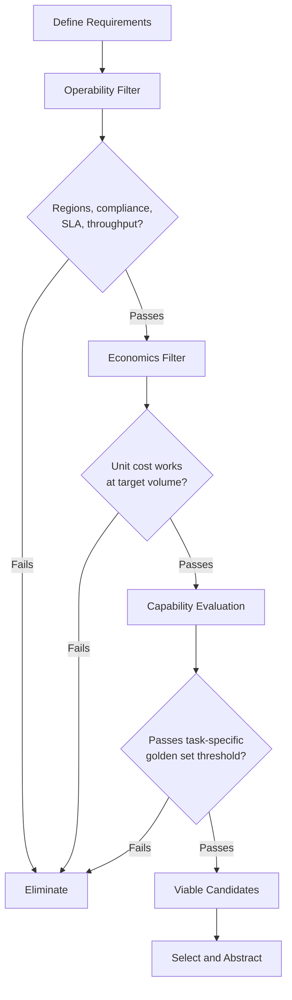

# Benchmark Scores Don't Deploy: The Three-Axis LLM Selection Problem

The leaderboard tells you which model scores higher on MMLU. It says nothing about whether that model will run in your environment, at your required throughput, within your token budget, under an SLA you can put in a contract. Most LLM selection processes stop at capability comparison. The teams that get surprised in production stopped there too.

Model selection is a three-axis constraint satisfaction problem: capability, economics, and operability. All three axes have minimum thresholds that must clear before an option is viable. Teams routinely over-optimize on capability, underweight economics, and ignore operability until a production incident forces the conversation.

---

## The Capability Axis Is Necessary but Not Sufficient

Benchmark scores are a coarse filter. MMLU measures breadth of general knowledge. SWE-bench measures autonomous software engineering. MATH measures mathematical reasoning. No benchmark measures whether a model can follow your system prompt format, maintain persona consistency across 50 turns, or extract the right entities from your specific document schema.

The useful question is not "which model scores highest on a leaderboard?" It is "which models clear a minimum capability threshold on my specific task?" That threshold, not a ranking, is what you need.

Capability evaluation that works does three things. First, it builds a task-specific golden set: 50 to 200 prompt-response pairs that represent the real input distribution your system will receive, including the edge cases and failure modes you have already seen. Second, it uses task-specific metrics. A summarization task cares about factual coverage and concision. A structured extraction task cares about schema compliance and null handling. Generic correctness scores tell you almost nothing about either. Third, it evaluates consistency across the distribution, not peak performance on favorable examples. A model that averages 90% but fails 40% of a specific edge case pattern is worse than a model that averages 82% with failure modes you can predict and guard against.

The practical implication: capability shortlisting should eliminate models, not rank them. Once three or four models pass your capability threshold, move to the axes that actually differentiate production viability.

---

## The Economics Axis Has Hidden Geometry

Token pricing is the entry point, not the analysis. The cost math that matters is total cost per unit of business value produced at your projected production volume, accounting for the full token load of each call.

Three factors make the geometry non-obvious.

**Context window taxation.** Most pricing models charge linearly per token, with input and output priced separately. A model supporting 128K context does not make 128K tokens cheap. Consider a production RAG call with a 4K system prompt, 12K of retrieved documents, 800 tokens of conversation history, and 600 tokens of output. That is roughly 17,400 input tokens per call. The difference between $0.002 per 1K input tokens and $0.008 per 1K is about $0.10 per call. At 10 million calls per month, that difference is roughly $1 million. Context window size is an architectural capability. What you inject into it is an economic decision.

**The reasoning tax.** Reasoning models (o-series from OpenAI, DeepSeek R1 class, and Gemini and Claude variants with extended thinking enabled) generate internal chain-of-thought tokens before producing a final response. Those tokens are typically billed as output. For a task requiring complex multi-step reasoning, that cost is justified. For a task that is fundamentally retrieval plus formatting, you are paying for compute you do not need. The reasoning tax can multiply your per-call output cost by an order of magnitude compared to a non-reasoning model on the same prompt.

**The serverless-to-provisioned crossover.** Pay-per-token API pricing looks attractive at low volume. At sustained production scale, provisioned throughput (Azure Provisioned Throughput Units, AWS Bedrock Provisioned Throughput, Vertex AI Provisioned Throughput) often has a lower effective cost per token with a guaranteed rate limit. The crossover is not a small number. Minimum PTU commitments and utilization overhead mean the break-even typically sits in the tens of millions of tokens per day of steady-state traffic, not the low millions. Run the math at your p50 and p95 call volumes, factor in utilization below 100%, and do not assume the cheaper sticker price wins at your actual load shape.

Build a unit economics model before committing to a model. What is the token cost of a single successful transaction at your target volume? What does that imply for margin at scale? The answer will eliminate options the capability evaluation left open.

---

## Operability Is Where Architectural Decisions Actually Get Made

This is the axis the benchmark articles do not cover.

A model that performs well on your evaluation set and clears your cost threshold is still not viable if you cannot run it reliably at your required throughput. Operability has three components: hosted availability, throughput ceilings, and latency guarantees.

### Open Source Weights Are Not a Service

The open source model ecosystem has produced exceptional models. Llama 3.3 70B, Mistral Large, Phi-4, DeepSeek V3, Gemma 3. These models are freely available as weights. Weights are not a production service.

When a team says "we'll use Llama 3.3 70B," they have decided on a capability profile. They have not decided anything about how that capability reaches production. The operational decisions are still open: which inference provider hosts it? What are that provider's rate limits at your required tier? Is it available in the regions your data residency requirements mandate? Does the provider have a Business Associate Agreement if you are in healthcare? What is the committed uptime SLA? What is the escalation path when inference latency degrades?

The managed open source model market has matured. Azure AI Foundry, AWS Bedrock, Google Vertex AI, Groq, Together AI, and Fireworks AI all offer hosted inference for major open source models. The capability delivered is largely equivalent across providers for the same model. The operational properties differ substantially.

| Provider | Typical Strength | Key Consideration |
|---|---|---|
| Azure AI Foundry | Enterprise agreements, broad region coverage, PTU for guaranteed throughput | High-throughput tiers require enterprise agreement |
| AWS Bedrock | Wide model catalog, strong compliance posture, provisioned throughput option | New model availability lags by weeks in some regions |
| Google Vertex AI | Gemini-native; strong Llama and Mistral coverage | Default quotas are restrictive; quota increase lead time can be days |
| Groq | Extremely low time-to-first-token on supported models | Smaller catalog; enterprise SLAs require dedicated agreement |
| Together AI / Fireworks AI | Broad open source catalog, serverless and dedicated tier | Fewer enterprise compliance certifications than major cloud providers |

Self-hosting is always available as an option. Running Llama 3.3 70B on vLLM across a cluster of H100s gives you full control over throughput, data locality, and long-run cost at scale. It also gives you full ownership of availability engineering, GPU procurement, patching, scaling logic, and incident response. For teams without existing GPU infrastructure and ML engineering capacity, self-hosting a frontier-class open source model typically costs more in total than managed alternatives until you reach significant scale, above roughly 5 billion tokens per month.

### Throughput Ceilings Shape What You Can Build

Every managed inference provider imposes rate limits: requests per minute, tokens per minute, concurrent connections. These limits determine whether a model choice is viable for your use case without significant mitigation engineering.

A customer-facing assistant handling 500 concurrent users generates a different request shape than a nightly batch job processing 100,000 documents. The first needs low latency and high request concurrency. The second needs high total throughput and can tolerate latency. The same model may be available for both patterns through the same provider, but the required rate limit tier, and therefore the cost, will differ substantially.

The check to run before committing to a provider: request the rate limit documentation for the access tier you expect to use and run the arithmetic against your peak load projection. For most managed providers, rate limits are enforced as hard ceilings at your quota boundary. You need to know where that boundary is before it becomes a production constraint.

### Latency Budgets Are Not Uniform

Time to first token and total generation time have different implications depending on your use case. A user-facing chat interface is sensitive to time to first token. A background document processing pipeline cares about total throughput, not time to first token. A real-time voice assistant cares about both.

Reasoning models compound this. o-series and DeepSeek R1 class models generate internal reasoning chains before producing output. Time to first visible token on a complex reasoning task can be tens of seconds. For synchronous user-facing interactions, that is often architecturally unacceptable regardless of output quality.

The practical rule: for synchronous user-facing applications, establish a time-to-first-token budget before model selection begins. Any model or provider combination that cannot reliably meet that budget at your concurrency level is not on the shortlist, regardless of benchmark position.

---

## The Order of Evaluation That Avoids Wasted Work

Run the axes in sequence. Capability evaluation is expensive to do rigorously. Do not run it on models you would never run in production.

Start with operability constraints. Define your required regions, compliance requirements (SOC2, HIPAA, FedRAMP), throughput floor, and latency ceiling. This eliminates providers and, by extension, a significant portion of the model list without any evaluation work. Then apply economics: build the unit cost model and eliminate options that do not work at your volume. What remains is your evaluation shortlist. Run capability evaluation only on that shortlist.

This sequence feels counterintuitive. Architects default to capability evaluation first because it is the most technically interesting problem. Operational and economic constraints feel like procurement, not architecture. In practice, the procurement constraints are the ones that end model selections, often after significant evaluation investment has already been made.

---

## What to Do With This

Model selection is not a one-time architectural decision. The model market is moving at a pace that makes any specific selection a temporary answer. The right architectural response is to abstract the model layer from the application layer. Tools like the Azure AI Model Inference API and LiteLLM provide a uniform interface over multiple model providers, making a model swap a configuration change rather than a refactoring task.

Design your system against a capability profile: context window requirement, output format contract, latency target, cost ceiling per call. Fill that profile with the best available option that clears all three axes today. Operate with the expectation that you will fill it with a different option in six to twelve months, because you will.

The teams treating model selection as an architectural commitment will rebuild their integration layer every time the leaderboard shifts. The teams treating it as a recurring operational decision, backed by the abstraction to support it, will adapt without the disruption.
